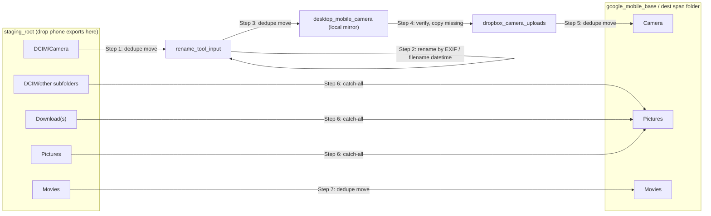

# mobile-backup

Move your phone’s photos/videos from a desktop **staging area** into a **month-span** Google Drive folder, with:
- file renaming (in-process, by EXIF/filename datetime),
- duplicate-aware moves (no more `_1` junk),
- conflict quarantine,
- junk sweeping (`.trashed*`, `.thumbnails`, `Contents.csv`, `desktop.ini`),
- clean logs,
- progress bars.

## Why this exists

Manual shuffles suck. This script codifies the flow you already do:
1) Drop `DCIM`, `Download`/`Downloads`, `Movies`, `Pictures` from your phone into a staging folder.
2) Rename the camera files by EXIF datetime.
3) Verify the files exist in Dropbox Camera Uploads.
4) Move everything into a Google Drive month folder named like `202509_202510`.

Renaming and verification used to live in two separate sibling repos
(`rename-images-to-datetime`, `files-in-folder`) that this project shelled out to.
That logic now lives here as `rename_images.py` and `organize_files.py`, callable
directly or as standalone CLI subcommands -- no more juggling three repos/envs.

## How it flows

The `run` pipeline is 7 steps, moving files through a few intermediate directories
before they land in the destination month-span folder. Every hop is dedupe-aware:
identical content is skipped and the source deleted; same-name-but-different content
is quarantined to `_conflicts/` instead of overwriting anything.



## What it does (the short version)

- **Dedupes by content**: if the same file already exists at the destination → skip and delete the source copy.
- **Merges folders**: no blind renames—existing folder wins; new content merges in.
- **Conflicts**: if names collide but bytes differ → file goes to `_conflicts/`.
- **Sweeps junk**: deletes `.trashed*`, `.thumbnails`, `Contents.csv`, `desktop.ini` along the way.
- **Dry-run first**: prints exactly what would happen, no changes.
- **Logs**: writes a log file so you can see the receipts later.

---

## Requirements

- Python 3.10+
- Poetry (https://python-poetry.org/)
- (Optional) `tqdm` for pretty progress bars.

WSL users: Windows paths like `C:\Users\...` become `/mnt/c/Users/...`.

---

## Install

poetry install
# (optional) pretty progress bars:
poetry add tqdm

## Configure

This repo does not track your real config. Copy the sample and fill in your own paths (no personal info in the repo).

Command: `cp config.example.yaml config.yaml`

`config.example.yaml` (safe template):

Copy to config.yaml and replace all /path/to/... with absolute paths for YOUR machine.

### Staging

where you drop DCIM, Download/Downloads, Movies, Pictures from the phone

staging_root: `/path/to/Desktop/mobile`

### Renamer working directory (Step 2 renames whatever lands here)
rename_tool_input: `/path/to/mobile-backup/input`

### Dropbox camera uploads
dropbox_camera_uploads: `/path/to/Dropbox/Camera Uploads`

### Google Drive "Mobile" base (script writes into `{prev}_{curr}` here)
google_mobile_base: `/path/to/Google Drive/Multimedia/Pictures/Personal/Mobile`

### Destination span (which `{span}` folder files land in)

`destination_span_mode`:
- `prev_curr_month` (default) -- auto `{prev}_{curr}` calendar month, e.g. `202509_202510`
- `file_date_range` -- derive the span from the actual dates of the files being processed. Use this for backfilling a batch of staged files that spans more than one month; a single `run` will land everything in one `{min-month}_{max-month}` folder instead of mislabeling old files under today's month.
- `override` -- use `destination_span_override` verbatim

```yaml
destination_span_mode: prev_curr_month
destination_span_override: null              # used only when mode is "override"
destination_span_date_source: filename        # filename|mtime|exif -- tried first, then the other two as fallback
destination_span_on_parse_failure: fallback_prev_curr  # fail|fallback_prev_curr
```

`destination_span_date_source` only matters in `file_date_range` mode: it's the *first* source tried per file; if that fails, the other two are tried in a fixed order (filename, mtime, exif) before giving up on that file. `destination_span_on_parse_failure` only matters if more than half the staged files can't be dated by any source -- `fail` raises, `fallback_prev_curr` falls back to the auto month-span behavior for the whole run.

### Where Camera files sit after rename (Desktop/mobile/DCIM/Camera)
desktop_mobile_camera: `/path/to/Desktop/mobile/DCIM/Camera`

### Defaults
`dry_run: true`      # start safe; prints “would move/delete …” lines
`verbosity: 0`       # 0=quiet, 1=notes (includes deleted-file details in real run), 2=debug

---

## Usage

`mobile_backup.py` is a small CLI with three subcommands:

- `run` -- the full pipeline (steps 1-7 below)
- `rename` -- standalone: rename images in `rename_tool_input` by EXIF/filename datetime
- `organize` -- standalone: verify `desktop_mobile_camera` files exist in `dropbox_camera_uploads`, copying over anything missing

### 1) Dry-run (recommended)

Run: `poetry run python mobile_backup.py run`

Expected output (example):
Destination span: `202509_202510` (auto)
Destination: `/path/to/.../Mobile/202509_202510`
Step 5: would delete 14 unwanted; would move 3438 files (skipped 98 dupes, conflicts 2) from /path/to/.../Camera Uploads -> .../Camera
Done. (dry run)

- No changes are made.
- A log file is written:
  - Dry run → in `google_mobile_base/` (won’t create the month folder)
  - Real run → in the month folder (e.g., .../202509_202510/mobile_backup_*.log)

### 2) Real run

Flip `dry_run: false` in `config.yaml`, then run: `poetry run python mobile_backup.py run`

You’ll get progress bars and a full log inside the month folder.

### 3) Post-run cleanup / audits

Preview (no changes): `poetry run python cleanup_folder.py 202509_202510`
Apply (fix `*_1` files/dirs; purge junk): `poetry run python cleanup_folder.py 202509_202510 --apply`

What `cleanup_folder.py` does:
- Delete `.trashed*`, `.thumbnails`, `Contents.csv`, `desktop.ini`
- Fix `*_1` files:
  - identical to base → delete `_1`
  - base missing → rename to base
  - different → quarantine to `_conflicts/`
- Fix `*_1` folders:
  - if base missing → rename to base
  - if base exists → merge contents (dedupe identicals, quarantine conflicts), then remove the `_1` dir
- Writes/appends `cleanup_log.txt` in the month folder.

---

## How safe is “safe”?

- We never overwrite existing files.
- If a destination file with the same name exists:
  - Identical content → source is skipped and deleted.
  - Different content → source is moved to `_conflicts/` for manual review.
- Junk is deleted before moves (in dry-run we just count what would be deleted).
- The scripts print counts for:
  - would delete / deleted
  - moved
  - skipped dupes
  - conflicts

---

## Typical staging layout

```
staging_root/
├─ DCIM/
│  ├─ Camera/
│  └─ <other DCIM subfolders>/
├─ Download/ or Downloads/
├─ Movies/
└─ Pictures/
```

You manually drop the phone’s exported folders here (via MTP, Android File Transfer, etc.). The script handles the rest.

---

## Troubleshooting

- WSL paths: Windows paths must be `/mnt/c/...`, `/mnt/d/...`, etc.
- Progress bars: install tqdm with `poetry add tqdm` for pretty bars; otherwise you’ll see periodic “X/N files” lines.
- Conflicts in `_conflicts/`: legit name collisions with different content—review and file them where you want.
- Accidentally created `_1` junk earlier: run the cleaner with `poetry run python cleanup_folder.py 202509_202510 --apply`
- Logs location:
  - Dry run → `google_mobile_base/`
  - Real run → month folder (e.g., .../202509_202510/mobile_backup_*.log)

---

## Development

Install: `poetry install --with dev`
Run tests: `poetry run pytest`
Full gate (format check + lint + type + coverage): `poetry run tox`
Auto-format: `poetry run tox -e format`

Housekeeping:
- Keep `config.yaml` local (ignored by git).
- Commit only `config.example.yaml`.

---

## License

MIT. See `LICENSE`.
